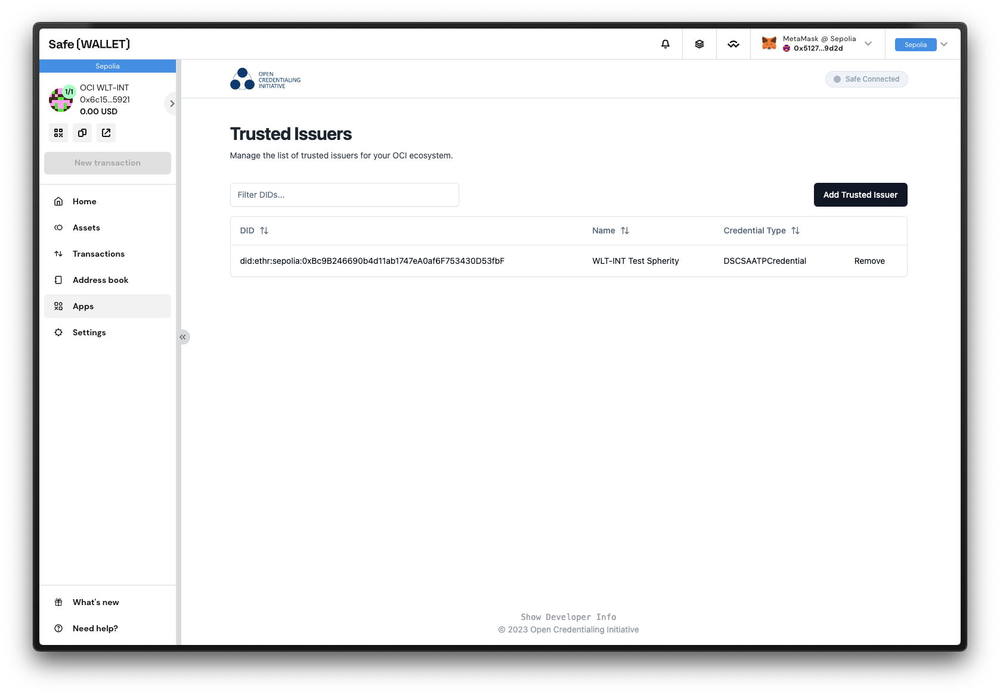
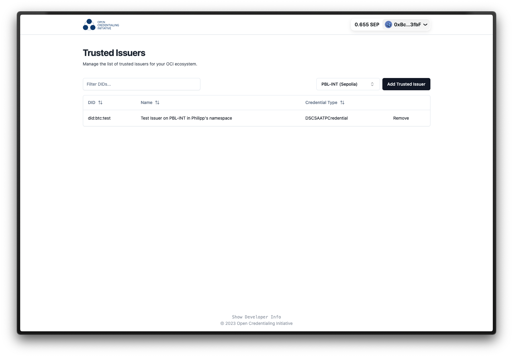

<div align="center">
    
    
</div>

<div align="center">

[](https://open-credentialing-initiative.github.io/Digital-Wallet-Conformance-Criteria/latest/)
[](https://github.com/Open-Credentialing-Initiative/trusted-issuer-frontend/graphs/contributors/)
[](https://github.com/Open-Credentialing-Initiative/trusted-issuer-frontend/issues/)
[](https://github.com/Open-Credentialing-Initiative/trusted-issuer-frontend/pull/)

</div>

---

## OCI Trusted Issuer Registry Frontend

This repository contains a Next.js frontend for the OCI Trusted Issuer Registry. It provides a web interface for the 
registry, allowing users to search for issuers and view their details. It also allows OCI statekeepers and developers
to manage the registry in their respective environment, adding and removing issuers.

### Setup

Install dependencies

```shell
pnpm i
```

Run development server

```shell
pnpm dev
```

### Deployment

The frontend is deployed to GitHub Pages. It is automatically deployed on every push to the `main` branch.

### Usage

The frontend is available at https://open-credentialing-initiative.github.io/trusted-issuer-frontend/.

#### For Statekeepers

The frontend allows statekeepers to add and remove issuers from the registry. Currently, Statekeepers can only work on
the STK-INT environment on the Ethereum Sepolia testnet that is supposed to mirror a future production environment on
Mainnet.

Statekeepers can only modify the registry if a majority of Statekeepers approve of an action. This is done by using a
shared (aka multi-signature) wallet that carries out all approved transactions for the Statekeepers. Approving actions
is done by Statekeepers individually signing the transaction in question with their Ledger hardware wallets.

This process is made easier by using [Safe.global](Safe.global), a web interface for the shared wallet. It allows 
Statekeepers to easily approve or reject transactions. Within Safe, Statekeepers can open a so-called "app" that allow 
them to specifically propose changes to the trusted issuer registry right from within the Safe web interface. For more a 
more detailed guide, follow the [OCI Statekeeper Guide (TBD)](#).


#### For OCI wallet developers

Official OCI digital wallets use the same setup as Statekeepers to manage the registry. However, they use a different
shared wallet on [Safe.global](Safe.global) that is only accessible to wallet developers. This allows wallet developers 
to add issuers to the registry without having to go through the Statekeeper approval process. This might be helpful for 
interoperability testing or other development purposes. For more a
more detailed guide, follow the [OCI TIR Developer Guide (TBD)](#).



#### For everyone else (developing)

By accessing the trusted issuer registry frontend directly *not through Safe*, you can only view the registry's data on
all environments. Developers can also, e.g. for other testing purposes, maintain their own trusted issuer lists on
the PBL-INT environment. Data is always written to the namespace of the connected wallet via inside the browser. No
voting process is needed here which should make development easier and faster. Therefor, PBL-INT is not meant to be
used for production purposes.



---

## 🤝 Contributing

OCI encourages contributions from OCI member and non-member companies and individuals.
Please send issues and pull requests by following our processes and agreements. Feel free to check the issues page.

**By contributing, companies and individuals certify the assertions made in
the [Developer's Certificate of Origin](https://developercertificate.org/).**

## 🏷️ Licence

By submitting their contribution to OCI, the contributor certifies that they have the right to submit it under the open
source license indicated here.

**This project is [Apache 2.0](http://www.apache.org/licenses/LICENSE-2.0)-licensed.**

You may not use this file except in compliance with the License.
You may obtain a copy of the License at

[http://www.apache.org/licenses/LICENSE-2.0](http://www.apache.org/licenses/LICENSE-2.0)

Unless required by applicable law or agreed to in writing, material
distributed under the License is distributed on an "AS IS" BASIS,
WITHOUT WARRANTIES OR CONDITIONS OF ANY KIND, either express or implied.
See the License for the specific language governing permissions and
limitations under the License.

Copyright © 2023 Named editors. Contributors to [OCI](https://www.oc-i.org/).